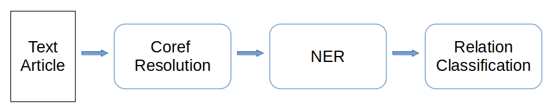
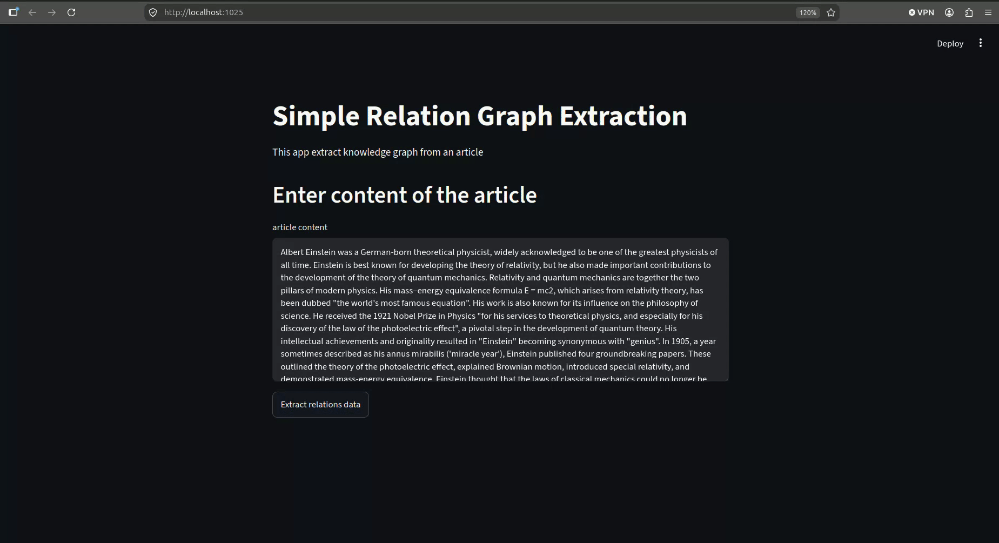

- [Simple Relation Graph Extractor](#simple-relation-graph-extractor)
  - [How is the system works](#how-is-the-system-works)
  - [App demo](#app-demo)
  - [How To run the apps](#how-to-run-the-apps)
    - [1. Run the API](#1-run-the-api)
    - [2. Run Streamlit app](#2-run-streamlit-app)
  - [Install depedencies](#install-depedencies)
    - [To install `fascoref`, first clone its repo.](#to-install-fascoref-first-clone-its-repo)

# Simple Relation Graph Extractor

This app extract entity objects and the relation between the entities.

The entities consist of **PER:person**, **ORG:Organization** and **LOC:Location**.

The relations extracted are **'located at'**, **'member of'** and **'origin'**.

## How is the system works



The text article will be processed to resolve the coreference in pronouns or nouns, after that we detect the entities in every sentences, then tagging the entities in each sentences and at the end we classify the relation for each entitiest tagged sentences consisting at least two detected entities.

For coreference resolution model, I use [Fastcoref](https://github.com/shon-otmazgin/fastcoref).

For NER and Relation Classifier, I fine tuned [distilbert-base-uncase](https://huggingface.co/distilbert/distilbert-base-uncased) model using [conllpp](https://huggingface.co/datasets/extraordinarylab/conllpp) and [Kbp37](https://huggingface.co/datasets/DFKI-SLT/kbp37) dataset for each task respectively. 

The graph visualization use [Neo4j Graph Visualization library](https://github.com/neo4j/python-graph-visualization).

## App demo



## How To run the apps

In terminal 

### 1. Run the API

- install docker if you haven't
- go to app/ (`cd /path/to/app`)
- run `docker-compose up --build`

### 2. Run Streamlit app

- go to streamlit_ui folder (`cd /path/to/streamlit_ui`)
- run `streamlit run graph_extract_ui.py --server.port [PORT_NUMBER]`


## Install depedencies

This is how to recreate my dev enviroment. 

``` bash
# create venv
conda create -n venv_name python=3.11

# I use 2.9.0 with cuda 12.6 since this is the last support for my GPU(compute capability 6.1) 
pip install torch==2.9.0 torchvision==0.24.0 torchaudio==2.9.0 --index-url https://download.pytorch.org/whl/cu126
pip install transformers==5.17.0
pip install spacy==3.8.16
python -m spacy download en_core_web_sm
pip install "fastapi[standard]==0.142.1"
pip install nltk==3.10.3
python -m nltk.downloader 'punkt_tab'
pip install numpy==2.4.6
pip install neo4j-viz==1.10.0
pip install streamlit==1.65.0 
```

### To install `fascoref`, first clone its repo.

``` bash
git clone git@github.com:shon-otmazgin/fastcoref.git
```

In case there is some dificulties related to depedencies, modify the depedencies requirement in `pyproject.toml` based on your need, for example lowering torch version to 2.9, etc.

Set workdir inside cloned repo directory, and run
```bash
pip install .
```

In Dockerfile, if you use pytorch>=2.14, then its recommended to install `fastcoref` from the main repo. 

- Change line for installing fastcoref into
``` Dockerfile
RUN pip install git+https://github.com/shon-otmazgin/fastcoref.git
```